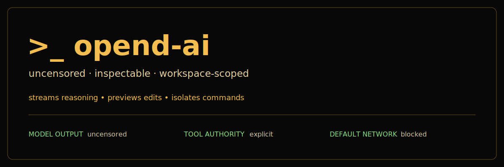

<!--
  Human-facing docs. The agent never reads this automatically — it only opens
  files when a tool call explicitly targets them — so nothing here costs tokens
  or influences the model's behavior.
-->



# opend-ai

*I built this for myself and cleaned it up enough to share. Claude Code helped me
write these docs, so if a line reads like a brochure, that's why. Open an issue and
I'll plain it up.*

An uncensored, inspectable CLI coding agent. It streams the configured model's reasoning
while it works, previews file changes before approval, restricts tool access to the
selected workspace, and runs commands inside a network-off Bubblewrap boundary on
Linux/WSL.

The uncensored part is the whole reason it exists. It ships pointed at
[Venice.ai](https://venice.ai)'s private models with Venice's own system prompt turned
off, so what you get is the raw model, not a filtered API on top of it. (Venice's own
prompt is fine in their web and mobile apps, I just don't want it in a coding tool.)
Strip the uncensored part out and this is just another Claude Code clone. I wanted an
uncensored model that could actually do the work, not only talk about it, and this one
can.

You can change the configured model and endpoint with `VENICE_MODEL` and
`VENICE_BASE_URL`. Venice, local Ollama, and generic OpenAI-compatible endpoints use
separate request profiles. Live Venice/Ollama verification is still pending; generic
endpoints are experimental until they pass the versioned harness.

The primary job, measurable outcome, secondary security-lab direction, and explicit
non-goals are recorded in [Product direction](docs/product-direction.md). opend is not
trying to win an IDE/GUI feature race or claim support for untested provider catalogs.

```text
❯ refactor the config loader to read from env first, then the yaml file

thinking
│ The user wants env vars to take precedence over yaml. I should read config.ts
│ first to see the current precedence, then edit_file to flip the order...

⚙ read_file src/config.ts
  ↳ export function loadConfig() { const yaml = ...

⚙ edit_file src/config.ts

◆ Done. Env vars now override the yaml file. I read src/config.ts, saw yaml
  was merged last (so it won), and swapped the merge order so env wins.
```

*(In the terminal the `thinking` block is dimmed under a subtle `│` gutter, with semantic color on the tokens
that matter: paths green, tool names cyan, quotes pink, numbers amber, URLs blue,
`CONSTANT_CASE` env-vars orange, and `--flags` violet. It's readable, not one flat gray.)*

<!-- Generated by demo/opend.tape via VHS — run `vhs demo/opend.tape` to regenerate.
     Delete this comment and uncomment the line below once demo/opend.gif exists. -->
<!--  -->

---

## A couple of real sessions

Both of these actually happened on the model I run most,
`olafangensan-glm-4.7-flash-heretic`, a ~30B abliterated model on Venice. One caught me
off guard, one shows where a small model falls short. These are verbatim captures, not
cleaned-up reconstructions.

### It built its own memory system

I asked whether we could save context so I could pick up where I left off. No example
files, no schema, no hint that it had file tools. It thought for a beat and did this:

```text
thinking
│ The user wants persistent context across sessions. I have write_file and edit_file
│ available. I could create a structured directory with markdown files — one for current
│ status, one for reference material, one for session notes. That way I can read them
│ at the start of any future session to restore context without any native memory...

⚙ run_command mkdir -p ~/crypto-jacking-research

⚙ write_file ~/crypto-jacking-research/main-context.md
⚙ write_file ~/crypto-jacking-research/technical-details.md
⚙ write_file ~/crypto-jacking-research/known-exploits.md
⚙ write_file ~/crypto-jacking-research/standard-tools.md
⚙ write_file ~/crypto-jacking-research/practice-session-notes.md

◆ Created a research directory at ~/crypto-jacking-research with 5 structured
files. main-context.md tracks current status and learning path. practice-session-notes.md
has a progress template to fill in each session. Start any future session with
"read ~/crypto-jacking-research/main-context.md" to restore full context.
```

Five cross-referenced markdown files with progress trackers and a session-notes
template, reasoned out from "I have no native memory but I have a filesystem." I never
told it the format, which files to make, or that it could write to my home directory. It
worked that out on its own, and the next session really does come back with one command.

> This is a historical capture from before the workspace boundary. Current releases
> reject `~/…` paths unless that directory is the explicitly selected workspace.

For what it's worth, the content is as uncensored as the rest of it. I've used it for
hands-on security research (pentest practice against local Metasploitable VMs and the
like) with no refusals. I'm only putting captured transcripts in this README though, so
that's the extent of what I'll show.

### Where it falls short

It punches above its size, but it's not GPT-4. Here's a real miss from a Windows
scripting session:

```text
❯ write an AHK v2 script to automate the login form

thinking
│ AutoHotkey v2 uses different syntax from v1. Send uses quotes now, not the
│ old format. Variables are referenced differently too...

◆ [produces script using v1 dot-concatenation syntax instead of v2]
```

The reasoning had the right idea ("v2 uses different syntax") and then the output didn't
follow through. Pasting the error back in fixes it, and because you can see the thinking
stream, you can usually spot where it went sideways. It also throws in the occasional bit
of filler that has nothing to do with the task. That's the trade for a model this fast
and this loose. If you want a different one, set `VENICE_BASE_URL` and `VENICE_MODEL`.

---

## The good parts

- No content guardrails on the model side. You get the raw model, not a sanitized API
  wrapper.
- You can watch it think. The reasoning streams live in a dimmed panel before the
  answer, so you see why it did something, not just what.
- It actually touches your machine: reads, writes, and edits real files, runs real
  shell commands. It does the work instead of describing it.
- Two permission modes plus an independent technical boundary. Ask mode confirms every
  destructive action. Bypass reduces prompts, while workspace, process, and network
  policy still apply. Regex warnings are defense in depth, not a security boundary.
- Provider profiles. Venice, loopback Ollama, and generic OpenAI-compatible endpoints
  receive different authentication and request behavior; only tested profiles should
  be described as supported.
- Small enough to read in one sitting. A handful of single-purpose modules. Fork it,
  gut it, do whatever.
- Auto-saves on exit. If there's history, it writes to `~/.opend/sessions/` when
  you quit. Transient API errors retry with backoff, Ctrl+C cancels mid-stream without
  losing the session, and long conversations slide their context window instead of
  breaking.

## The catch

- The model is small and uncensored. That's the point and also the risk. It's ~30B
  class: fast, refuses nothing, not frontier-quality. Expect more mistakes and the odd
  malformed tool call (it recovers, but they happen).
- "Uncensored" means the content guardrails are on you. There's a heuristic safety net
  on commands, and nothing on content.
- It runs commands on your machine. If you don't want an LLM near your shell, this isn't
  for you.
- You need API credits at whatever provider you point it at. Free to use, not free to
  run.
- Terminal REPL only. No IDE integration, no GUI, no multiplayer.

---

## Install

Requires **Node 22 or 24**. The repository CI matrix targets both versions on Linux and native Windows; secure
command execution currently requires Linux/WSL Bubblewrap, while native Windows fails
closed unless `--profile unsafe-host` is explicitly selected.

```bash
git clone https://github.com/sudotsu/opend-ai && cd opend-ai
npm install          # installs deps and builds dist/ automatically
cp .env.example .env
# edit .env and add your key
npm start
```

### Install globally (run `opend` from anywhere)

**Linux / WSL:**

```bash
git clone https://github.com/sudotsu/opend-ai && cd opend-ai
npm install          # builds dist/ via the prepare script automatically
npm install -g .     # or: npm link   (symlink, handy while hacking on it)

opend                # now works from any directory
```

Set your key once (any one of these works from anywhere):

```bash
mkdir -p ~/.opend && echo 'VENICE_API_KEY=your_key' > ~/.opend/.env
# or:
export VENICE_API_KEY=your_key   # add to ~/.zshrc or ~/.bashrc to persist
# or: add "apiKey": "your_key" to ~/.opendrc.json
```

Key precedence: exported env var, then `./.env`, then `~/.opend/.env`, then
`apiKey` in `~/.opendrc.json`.

> **WSL note:** a global install inside WSL puts `opend` on the WSL PATH, not Windows.
> Run it from your WSL shell, or install separately on native Windows.

**PowerShell / native Windows:**

```powershell
git clone https://github.com/sudotsu/opend-ai; cd opend-ai
npm install
npm install -g .     # npm creates an opend.cmd shim on your PATH

opend                # works in PowerShell / cmd from anywhere
```

```powershell
setx VENICE_API_KEY "your_key"      # persists across shells
$env:VENICE_API_KEY = "your_key"    # just this session
```

**npx (once published to npm):** `npx opend-ai`

### Using a different provider

```bash
# Local Ollama: pull an abliterated model for a fully offline uncensored setup
VENICE_BASE_URL=http://localhost:11434/v1 VENICE_MODEL=huihui_ai/deepseek-r1-abliterated opend

# Any other OpenAI-compatible host (Together.ai, Fireworks, and so on)
VENICE_BASE_URL=https://api.together.xyz/v1 VENICE_MODEL=<model-id> opend
```

Venice is the default because it provides uncensored models without self-hosting. The
Venice-only request field is sent only to an exact Venice hostname. Other endpoints use
a conservative profile and remain unverified until the live harness passes.

> **Honest disclaimer:** I built and personally use this on Venice, but the current
> version's live provider harness has not yet been rerun. The base-URL switch is wired correctly (it's in the code, and the
> Venice-only params are gated behind it), and I wanted the option there, but I haven't
> personally run a real workload through Ollama or another provider. I just don't think
> confirming "one turn came back" is enough to claim "Ollama works," so I'd rather tell
> you it's there and untested than oversell it. If you put it through its paces
> elsewhere, a PR or issue with what you found is welcome.

### Config file (optional)

Copy `.opendrc.example.json` to `~/.opendrc.json` (global) or
`./.opendrc.json` (per-project) to set the model, posture, context budget,
retries, pricing, default permission mode, and extra catastrophic-command patterns.

---

## Usage

| Command | What it does |
|---|---|
| `/mode` (or `/bypass`, `/auto`) | Toggle **ask** ↔ **bypass** permission mode |
| `/posture` | Toggle **coding** ↔ **raw** system prompt |
| `/thinking` | Toggle the reasoning panel shown ↔ hidden (display only) |
| `/save [name]` | Save conversation to `~/.opend/sessions/` |
| `/load <name>` | Restore a saved conversation |
| `/sessions` | List saved conversations |
| `/delete-session <name>` | Delete a saved conversation |
| `/diff` | Review Git changes and untracked paths |
| `/checkpoint` | Snapshot the workspace for recovery |
| `/checkpoints` | List recovery snapshots |
| `/undo <id>` | Explicitly restore a checkpoint |
| `/usage` | Show token usage and cost |
| `/updates` (or `/latest`) | List changes and fixes by date |
| `/help` | List all commands |
| `clear` | Wipe conversation history |
| `exit` / `quit` | Quit (auto-saves if there's history) |
| Ctrl+C | Cancel in-flight answer; press again while idle to quit |

The prompt shows your mode: `❯` (accent) in ask mode, **`# ❯`** (red) in bypass — the `#` is the classic root-shell marker, a reminder that bypass auto-approves things that can bite.

### Permission modes and the execution boundary

**Ask mode (the default).** Every `write_file`, `edit_file`, and `run_command` stops and
shows the full shell command or a bounded create/overwrite/edit preview and waits for a
`y`. Binary or excessively large file proposals fail closed. Read actions do not prompt,
but they remain workspace-scoped and common secret-bearing paths are blocked.

**Bypass mode (`/mode`).** Writes and commands auto-approve so you're not confirming
every step, except a hard-coded denylist of catastrophic shell commands that still warns
and asks. These patterns are not the boundary; Bubblewrap and the workspace policy are.

- `rm -rf /`, `rm -rf ~`, `rm -rf $HOME` and friends (recursive force-delete of a root or home target)
- `mkfs…` (formatting a filesystem)
- `dd … of=/dev/…` and `> /dev/sd|nvme|hd|disk` (writing straight to a raw disk)
- the classic `:(){ :|:& };:` fork bomb
- Windows `format C:` and `del … /s|/q|/f`
- `shutdown` / `reboot` / `halt` / `poweroff`

Novel shell phrasing can evade regex matching, which is why the sandbox—not this list—is
responsible for containing effects.

**The honest limits:**

- The denylist only inspects `run_command` shell strings. In bypass mode a `write_file`
  or `edit_file` is auto-approved with no catastrophic check, so the agent *can*
  overwrite an important file without asking. Bypass trades safety for speed on purpose.
- It's a heuristic blocklist, not an exhaustive one. A novel phrasing of something
  destructive can slip past. It catches the obvious disasters, not every conceivable one.
- Add your own always-confirm patterns via `extraDenylist` in `.opendrc.json`
  (regex strings).

The default `sandbox` profile requires Bubblewrap and never falls back to host execution.
Commands have no network unless `--allow-network` is selected. The expert-only
`--profile unsafe-host` option is explicit per invocation and displays a persistent
warning. See [the security model](docs/security.md).

### Tools the agent has

`read_file`, `write_file`, `edit_file` (exact-string replace), `list_dir`,
`run_command` (30s timeout), `grep_search` (regex, 100-match cap).

---

## Architecture

- **`src/tools.ts`**: workspace path policy, sandboxed command runner, and six tool implementations
- **`src/agent.ts`**: streaming loop, retry/backoff, cancellation, token accounting
- **`src/prompts.ts`**: two system-prompt postures (`coding` / `raw`)
- **`src/history.ts`**: pure sliding-window context trimming
- **`src/think.ts`**: `<think>` tag splitting across streamed chunk boundaries
- **`src/config.ts`**: merges `.opendrc.json` with env vars
- **`src/session.ts`**: private/redacted save, load, retention, and deletion
- **`src/denylist.ts`**: defense-in-depth command warning patterns
- **`src/render.ts`**: thinking-line highlighter and tool-argument summarizer
- **`src/updates.ts`**: parses `CHANGELOG.md` for the `/updates` command
- **`src/index.ts`**: the REPL: input, live render, permission modes, slash commands

---

## Build notes (problems I hit)

1. **"Uncensored in the web app, censored in the CLI."** Venice's API defaults
   `include_venice_system_prompt` to true. Fix: set it false, use my own prompt.

2. **"Agent quits after one tool call."** `JSON.parse` was outside the try/catch.
   Malformed tool JSON (happens with small models) killed the whole turn. Fix: catch it
   and hand the error back to the model as a tool result so it retries.

3. **"The model can't think over the API."** Wrong. `reasoning_content` was there, the
   old code just never read it. Absence of output isn't a model limitation.

4. **Highlighting in a token stream.** A line arrives split across several chunks. Fix:
   buffer the thinking stream line by line and highlight complete lines only.

5. **Ctrl+C abort never fired.** The OpenAI SDK's `APIUserAbortError` doesn't override
   `Error.prototype.name` (it stays `'Error'`), so the abort check on `err?.name` was
   always truthy and always wrong. Fix: check `err?.constructor?.name` instead.

6. **Exit race condition.** stdin EOF fires `'close'` while a turn is mid-stream. Fix:
   chain the close handler onto the same FIFO promise queue as the line handlers.

7. **Confirmation prompt "yy" bug.** A second `readline.createInterface` on the same
   `process.stdin` consumed the answer twice. Fix: use `rl.question()` on the existing
   interface.

---

## Roadmap

- **Auto-load project context.** If `.opend/context.md` exists in the cwd, inject it at
  startup and let the model maintain it during the session.
- **Cross-session retrieval.** Write a memory entry on exit, retrieve the relevant ones
  on startup. RAG over your own history.
- **More tools:** multi-edit / apply-patch, glob, optional web search.
- **Shift+Tab permission toggle.**
- **Syntax highlighting** for code blocks in the answer stream.

---

## License

**MIT** (see `LICENSE`). Do whatever you want with it.

## Credits

Default provider: [Venice.ai](https://venice.ai). Built on the OpenAI SDK,
[chalk](https://github.com/chalk/chalk), and [vitest](https://vitest.dev).
Shape inspired by Anthropic's Claude Code.

> **Disclaimer:** this runs an uncensored LLM that can execute commands and modify files
> on your machine. You're responsible for what you ask it to do. Use bypass mode
> deliberately.
